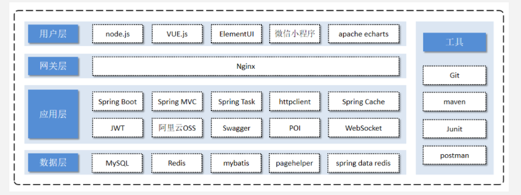

## 项目简介

本项目是一个面向江西理工大学全体校生的在线判题系统，拥有在线答题、在线比赛等功能，旨在统计同学们的编程能力，方便同学们的学习交流，为江西理工的同学提供一个编程交流学习平台。

## 系统架构图

## # 开发初心

1. 为学校建立一套OJ系统，方便同学们对于算法的学习
2. 为学校老师开发一套学生专项学习管理系统，在相应的算法知识领域的学习可以做到方便管理
3. 为江西理工大学ACM工作室开发一套学习和管理系统，方便同学们对于算法的学习以及工作室的管理，包括同学们的学习进度管理，队伍情况管理等。通过规则的建立和管理制度的建立来提升学校工作室的质量、实力以及影响力。

## # 实现界面

#### 功能与需求
1. 1. 需要有一个展示最新消息的“新闻”功能
   2. 需要有一个今日人品的打卡功能，用户可以点击打卡然后获取今日人品
2. 题库界面
   1. 需要有新建题目功能，并且有新建题目时有登录验证
   2. 需要有题目展示功能，并且每页展示若干条题目，实现分页展示效果
   3. 需要有题目搜索功能，搜索关键词包括题目名称、题目ID、题目内容、题目标签
3. 题目详情界面
   1. 需要有题目的所有信息，并且支持Markdown格式和Letex公式
   2. 需要有编辑题目功能，用户点击之后可以编辑相关的题目，并且同步到数据库
   3. 需要有提交代码功能，用户点击之后可以提交对应题目的代码
   4. 需要有上传数据的功能，用户可以上传对应的题目数据
4. 用户信息界面
   1. 需要展示用户的相关信息，包括头像，昵称，格言，提交数量和通过数量等信息
   2. 需要有各个与用户相关的信息展示选项，包括主页、动态、题库、组织和收藏等功能
   3. 需要有用户信息修改选项，用户可以修改对于的个人信息
5. 新建题目界面
   1. 用户可以通过该页面创建基础的题目信息
6. 提交代码界面
   1. 用户可以通过该页面提交代码，并且可以选择对应的题号和选择的语言
7. 评测结果界面
   1. 用户可以通过该页面来查看自己代码的提交结果
8. 评测队列界面
   1. 用户可以看到历史的评测记录
9. 组织界面
   1. 需要展示所有的组织，并且可以新建组织
10. 比赛界面
   1. 需要展示目前所有的比赛，包括正在进行、还未开始等不同比赛的情况
   2. 需要有新建比赛功能
11. 排行榜界面
   1. 需要展示所有用户的排行榜，排行依据是用户的Rank分值
12. 管理员界面
   1. 需要有一个管理员界面，让管理员可以管理网站的相关信息
13. 聊天交互功能
   1.	用户之间可以通过聊天进行交互
   2.	系统会通过该功能向用户发送相关交互信息
14. 学习任务功能
   1.	学习任务的增删改查功能，用户可以使用学习任务。具体的，完成多少道题目等
   2. 学习任务发布功能，任务将可以被创建者发布给同学们
   3. 学习任务提醒功能，任务将要到期时可以通过邮箱等方式提醒用户
15. 知识星球功能
   1. 目前是希望做一个可扩展性比较强的知识存储体系，并且希望对于新生会比较友好，希望能够有助于新生对自己的未来规划
   2. 可以做很多的分类，比如工作室级别的，班级级别的，专业级别的，学院级别的甚至学校级别的
   3. 这个功能目的主要是为了引导新生们规划好自己的大学学习方向，做好未来规划，不让新生再迷茫，同时可以起到一个大家互相学习互利共赢的局面

