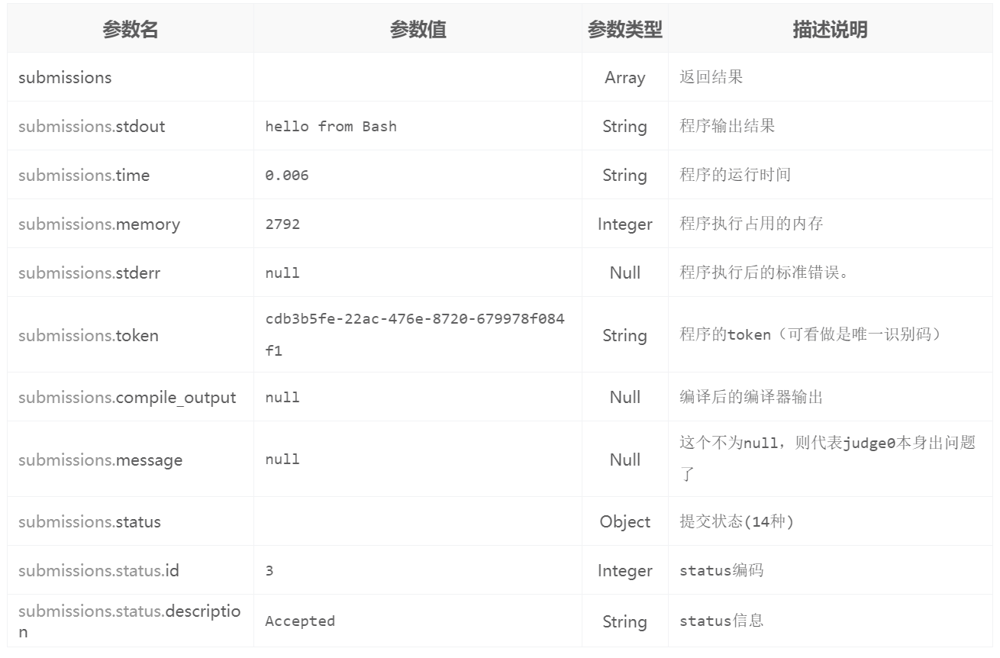
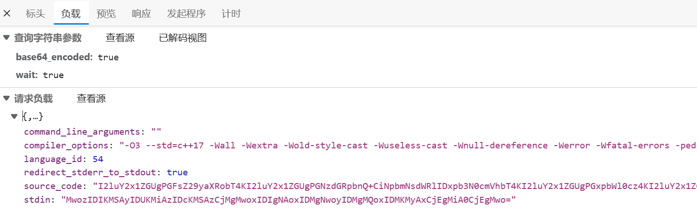
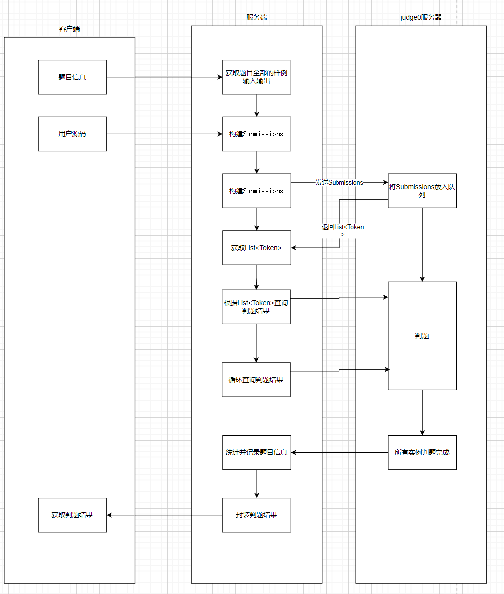

# 环境配置

## 在ubuntu中安装Judge0：

确保安装了docker和docker compose
看教程就完事了，官方文档写得很好

**参考**：

[安装docker compose](https://docs.docker.com/compose/install/linux/#install-using-the-repository)

[judge0自建版官方安装教程](https://github.com/judge0/judge0/blob/master/CHANGELOG.md#deployment-procedure)

# judge0安装遇到的问题记录

下载缓慢问题:[docker安装，以及docker源修改，docker-compose安装一条龙_docker-compose 镜像源___WHOAMI的博客-CSDN博客](https://blog.csdn.net/qq_28597013/article/details/121864092)

执行docker-compose up -d命令时报错。

**解决方法**：按提示的来（没啥困难的）

```shell
root@hecs-278615:~/judge0/judge0-v1.13.0# docker-compose up -d

Command 'docker-compose' not found, but can be installed with:

snap install docker          # version 20.10.17, or
apt  install docker-compose  # version 1.25.0-1

See 'snap info docker' for additional versions.
```

# judge0的API

参考：[Judge0 CE - API Docs](https://ce.judge0.com/)

judge0 有很多API，我在：[judge0API阅读测试](https://console-docs.apipost.cn/preview/3e3232a9746a65b8/533a4321aaab9848)中进行了简单的测试。

其中非常有用的API就是：submissions和workers

可以通过访问Judge0的官方网站[Judge0 IDE](https://ide.judge0.com/)来体验官方的API，没有访问官方IDE之前，我无法理解这个接口的运转模式。

## api-submission

这个接口可以用于提交在指定运行时约束的可用编程语言之一中运行任意源代码。Submission有33个属性。属性1-20用于创建新的提交，而属性21-33给出提交执行后的详细信息。

### api属性参考表

| #      | Name                                       | Type                    | Unit     | Description                                                                                                                                                                                                                                                                                                                                                                                                     | Default Value                                                                                                                                  |
| ------ | ------------------------------------------ | ----------------------- | -------- | --------------------------------------------------------------------------------------------------------------------------------------------------------------------------------------------------------------------------------------------------------------------------------------------------------------------------------------------------------------------------------------------------------------- | ---------------------------------------------------------------------------------------------------------------------------------------------- |
| use-1  | source_code                                | text                    |          | Program’s source code.                                                                                                                                                                                                                                                                                                                                                                                          | No default. This attribute is required for [single-file programs](https://ce.judge0.com/#header-single-file-programs-and-multi-file-programs). |
| use-2  | language_id                                | integer                 |          | [Language](https://ce.judge0.com/#statuses-and-languages-language) ID.                                                                                                                                                                                                                                                                                                                                          | No default. This attribute is required.                                                                                                        |
| 3      | compiler_options                           | string (max. 512 chars) |          | Options for the compiler (i.e. compiler flags).（编译器的选项(即编译器标志)。）                                                                                                                                                                                                                                                                                                                                                | null                                                                                                                                           |
| 4      | command_line_arguments                     | string (max. 512 chars) |          | Command line arguments for the program.（程序的命令行参数）                                                                                                                                                                                                                                                                                                                                                               | null                                                                                                                                           |
| use-5  | stdin                                      | text                    |          | Input for program.（程序输入）                                                                                                                                                                                                                                                                                                                                                                                        | null. Program won’t receive anything to standard input.                                                                                        |
| use-6  | expected_output                            | text                    |          | Expected output of program. Used when you want to compare with stdout.（程序的预期输出）                                                                                                                                                                                                                                                                                                                                 | null. Program’s stdout won’t be compared with expected_output.                                                                                 |
| use-7  | cpu_time_limit                             | float                   | second   | Default runtime limit for every program. Time in which the OS assigns the processor to different tasks is not counted.（每个程序的默认运行时限制。根据服务器配置，暂时设置为5）                                                                                                                                                                                                                                                             | Depends on [configuration](https://ce.judge0.com/#system-and-configuration-configuration-info).                                                |
| use-8  | cpu_extra_time                             | float                   | second   | When a time limit is exceeded, wait for extra time, before killing the program. This has the advantage that the real execution time is reported, even though it slightly exceeds the limit.（超时等待时间，可用来计算实际运行时间，根据服务器配置，暂时设置为1）                                                                                                                                                                                  | Depends on [configuration](https://ce.judge0.com/#system-and-configuration-configuration-info).                                                |
| use-9  | wall_time_limit                            | float                   | second   | Limit wall-clock time in seconds. Decimal numbers are allowed. This clock measures the time from the start of the program to its exit, so it does not stop when the program has lost the CPU or when it is waiting for an external event. We recommend to use cpu_time_limit as the main limit, but set wall_time_limit to a much higher value as a precaution against sleeping programs.（根据汪的服务器信息，这个值应该设置为10） | Depends on [configuration](https://ce.judge0.com/#system-and-configuration-configuration-info).                                                |
| use-10 | memory_limit                               | float                   | kilobyte | Limit address space of the program（限制程序的地址空间最大为128000）.                                                                                                                                                                                                                                                                                                                                                         | Depends on [configuration](https://ce.judge0.com/#system-and-configuration-configuration-info).                                                |
| use-11 | stack_limit                                | integer                 | kilobyte | Limit process stack.（进程堆栈限制）（64000）                                                                                                                                                                                                                                                                                                                                                                             | Depends on [configuration](https://ce.judge0.com/#system-and-configuration-configuration-info).                                                |
| use-12 | max_processes_and_or_threads               | integer                 |          | Maximum number of processes and/or threads program can create.（创建的线程和进程最大数量）（60）                                                                                                                                                                                                                                                                                                                                | Depends on [configuration](https://ce.judge0.com/#system-and-configuration-configuration-info).                                                |
| use-13 | enable_per_process_and_thread_time_limit   | boolean                 |          | If true then cpu_time_limit will be used as per process and thread.（false）                                                                                                                                                                                                                                                                                                                                      | Depends on [configuration](https://ce.judge0.com/#system-and-configuration-configuration-info).                                                |
| use-14 | enable_per_process_and_thread_memory_limit | boolean                 |          | If true then memory_limit will be used as per process and thread.（false）                                                                                                                                                                                                                                                                                                                                        | Depends on [configuration](https://ce.judge0.com/#system-and-configuration-configuration-info).                                                |
| use-15 | max_file_size                              | integer                 | kilobyte | Limit file size created or modified by the program.（限制由程序创建或修改的文件大小）（1024）                                                                                                                                                                                                                                                                                                                                      | Depends on [configuration](https://ce.judge0.com/#system-and-configuration-configuration-info).                                                |
| use-16 | redirect_stderr_to_stdout                  | boolean                 |          | If true standard error will be redirected to standard output.（false）                                                                                                                                                                                                                                                                                                                                            | Depends on [configuration](https://ce.judge0.com/#system-and-configuration-configuration-info).                                                |
| use-17 | enable_network                             | boolean                 |          | If true program will have network access.（false）                                                                                                                                                                                                                                                                                                                                                                | Depends on [configuration](https://ce.judge0.com/#system-and-configuration-configuration-info).                                                |
| use-18 | number_of_runs                             | integer                 |          | Run each program number_of_runs times and take average of time and memory.（1）                                                                                                                                                                                                                                                                                                                                   | Depends on [configuration](https://ce.judge0.com/#system-and-configuration-configuration-info).                                                |
| 19     | additional_files                           | Base64 Encoded String   |          | Additional files that should be available alongside the source code. Value of this string should represent the content of a .zip that contains additional files. This attribute is required for [multi-file programs](https://ce.judge0.com/#header-single-file-programs-and-multi-file-programs).（多文件程序用到的，暂时不用）                                                                                               | null                                                                                                                                           |
| 20     | callback_url                               | string                  |          | URL on which Judge0 will issue PUT request with the submission in a request body after submission has been done.（在提交完成后，Judge0将在请求体中发出PUT请求的URL。？？？）                                                                                                                                                                                                                                                            | null                                                                                                                                           |
| 21     | stdout                                     | text                    |          | Standard output of the program after execution.（程序执行后的标准输出）                                                                                                                                                                                                                                                                                                                                                     |                                                                                                                                                |
| 22     | stderr                                     | text                    |          | Standard error of the program after execution.                                                                                                                                                                                                                                                                                                                                                                  |                                                                                                                                                |
| 23     | compile_output                             | text                    |          | Compiler output after compilation.                                                                                                                                                                                                                                                                                                                                                                              |                                                                                                                                                |
| 24     | message                                    | text                    |          | If submission status is Internal Error then this message comes from Judge0 itself, otherwise this is status message from [isolate](https://github.com/ioi/isolate).                                                                                                                                                                                                                                             |                                                                                                                                                |
| 25     | exit_code                                  | integer                 |          | The program’s exit code.                                                                                                                                                                                                                                                                                                                                                                                        |                                                                                                                                                |
| 26     | exit_signal                                | integer                 |          | Signal code that the program recieved before exiting.                                                                                                                                                                                                                                                                                                                                                           |                                                                                                                                                |
| 27     | status                                     | object                  |          | Submission [status](https://ce.judge0.com/#statuses-and-languages-status).                                                                                                                                                                                                                                                                                                                                      |                                                                                                                                                |
| 28     | created_at                                 | datetime                |          | Date and time when submission was created.                                                                                                                                                                                                                                                                                                                                                                      |                                                                                                                                                |
| 29     | finished_at                                | datetime                |          | Date and time when submission was processed.                                                                                                                                                                                                                                                                                                                                                                    | null if submission is still in queue or if submission is processing.                                                                           |
| 30     | token                                      | string                  |          | Unique submission token which can be used to [get a specific submission](https://ce.judge0.com/#submissions-submission-get).                                                                                                                                                                                                                                                                                    |                                                                                                                                                |
| 31     | time                                       | float                   | second   | Program’s run time.                                                                                                                                                                                                                                                                                                                                                                                             |                                                                                                                                                |
| 32     | wall_time                                  | float                   | second   | Program’s wall time. Will be greater or equal to time.                                                                                                                                                                                                                                                                                                                                                          |                                                                                                                                                |
| 33     | memory                                     | float                   | kilobyte | Memory used by the program after execution.                                                                                                                                                                                                                                                                                                                                                                     |                                                                                                                                                |

## 项目中需要用到的API

经过一番探索后发现： `/submissions/batch`这个接口非常好用，而且虽然有很多的参数，但是使用到的并不多。草率了。

#### 推送多个代码测试

测试用例如下：

**Example URL:**

**Post**`https://114.115.150.229:2358/submissions/batch`

**Request:**

Headers:

```
Content-Type: application/json
```

Body

```
{
  "submissions": [
    {
      "language_id": 46,
      "source_code": "echo hello from Bash"
    },
    {
      "language_id": 71,
      "source_code": "print(\"hello from Python\")"
    },
    {
      "language_id": 72,
      "source_code": "puts(\"hello from Ruby\")"
    }
  ]
}
```

**Response(201)**

Body

```
[
  {
    "token": "db54881d-bcf5-4c7b-a2e3-d33fe7e25de7"
  },
  {
    "token": "ecc52a9b-ea80-4a00-ad50-4ab6cc3bb2a1"
  },
  {
    "token": "1b35ec3b-5776-48ef-b646-d5522bdeb2cc"
  }
]
```

#### 查看多个代码测试结果

测试用例如下：

**Example URL:**

**Post**`114.115.150.229:2358/submissions/batch?tokens=cdb3b5fe-22ac-476e-8720-679978f084f1,b3fe594f-6dce-4adf-9954-6c2220ef249c,93d49b15-2d79-40bd-8ef5-ed3a4b1b99fe`

**Request:**

Headers:

```
Content-Type: application/json
```

**Response(201)**

Body

```
{
    "submissions": [
        {
            "stdout": "hello from Bash\n",
            "time": "0.006",
            "memory": 2792,
            "stderr": null,
            "token": "cdb3b5fe-22ac-476e-8720-679978f084f1",
            "compile_output": null,
            "message": null,
            "status": {
                "id": 3,
                "description": "Accepted"
            }
        },
        {
            "stdout": "hello from Python\n",
            "time": "0.024",
            "memory": 8300,
            "stderr": null,
            "token": "b3fe594f-6dce-4adf-9954-6c2220ef249c",
            "compile_output": null,
            "message": null,
            "status": {
                "id": 3,
                "description": "Accepted"
            }
        },
        {
            "stdout": "hello from Ruby\n",
            "time": "0.059",
            "memory": 10824,
            "stderr": null,
            "token": "93d49b15-2d79-40bd-8ef5-ed3a4b1b99fe",
            "compile_output": null,
            "message": null,
            "status": {
                "id": 3,
                "description": "Accepted"
            }
        }
    ]
}
```

**返回的参数说明：**



# 关于Judge0自带的IDE

Judge0-IDE开源地址：[judge0/ide](https://github.com/judge0/ide)

了解了Judge0的API之后，我对Judge0有了一个大致的了解，但是我并不清楚Judge0的标准API输入输出格式是什么样的，于是我对Judge0的IDE研究了一下。

Judge0的IDE访问的接口是：submissions?base64_encoded=true&wait=true，

请求负载为：command_line_arguments（程序的命令行参数，一般用不上）、compiler_options（编译器标志）、language_id、redirect_stderr_to_stdout（将标准错误重定向至标准输出）、source_code、stdin



了解了Judge0自带的IDE后，我决定把提交题目的接口发送参数设置为：

```java
{
    "source_code": "cHVibGljIGNsYXNzIE1haW4gewogICAgcHVibGljIHN0YXRpYyB2b2lkIG1haW4oU3RyaW5nW10gYXJncykgewogICAgICAgIFN5c3RlbS5vdXQucHJpbnRsbigiaGVsbG8sIHdvcmxkIik7CiAgICB9Cn0K",
    "language_id": 62,
    "redirect_stderr_to_stdout": true,
    "stdin": "",
    "command_line_arguments": "",
    "compiler_options": ""
}
```

# 关于Judge0可以使用的语言

62是java，26,27都不行，，，

## 判题逻辑设计

本来想画成时序图的，以后再更新好了


